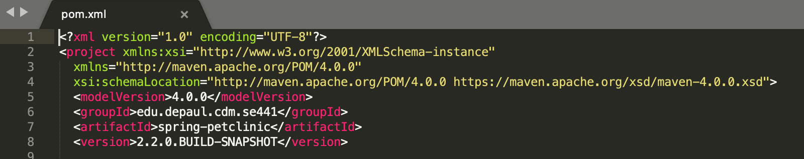

Adam Brown 1886478

- GitHub account with repository forked from depaulcdm/spring-petclinic

- Travis CI dashboard showing successful first build

- POM.xml with changed coordinates

- Travis CI dashboard showing successful build after changed group ID

- POM.xml with coordinates commented out

- Travis CI dashboard showing unsuccessful build after broken POM.xml

- readme.md showing failed build

- POM.xml with restored coordinates

- Travis CI dashboard showing successful build after fixed POM.xml

- readme.md showing build success status
